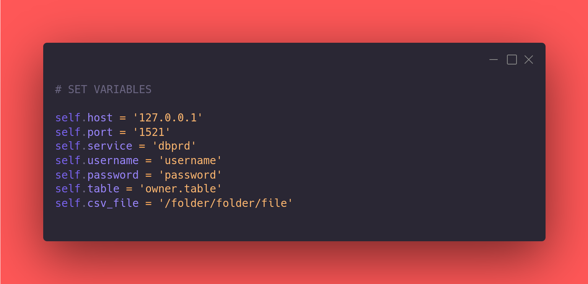
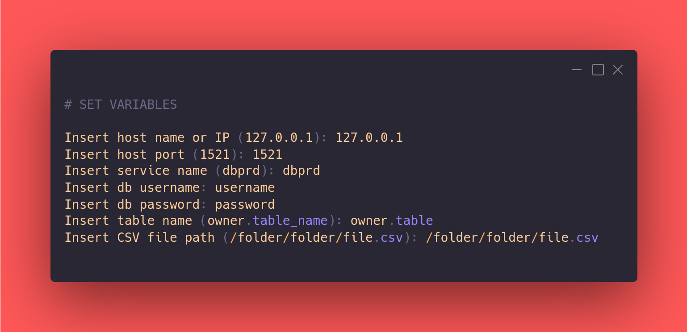

# Fast way to turn a CSV file into a Oracle db table

## Prerequisites

### Python

### Python packages:

~~~Bash
$ pip install pandas
$ pip install cx_Oracle
$ pip install unidecode
~~~

## ImportCSV editing the Python file

### 1. Download the ImportCSV.py file.

### 2. Place it in the same folder that it is the CSV file.

### 3. Configure the variables in ImportCSV.py file.

### 4. Run the Python script.

~~~Bash
$ python ImportCSV.py
~~~

### Congratulations, your Oracle db table is ready!

## ImportCSV with input file

### 1. Download the ImportCSV_Input.py file.

### 2. Place it in the same folder that it is the CSV file.

### 3. Run the Python script.

~~~Bash
$ python ImportCSV_Input.py
~~~

### 4. Insert the variables in terminal.

### Congratulations, your Oracle db table is ready!