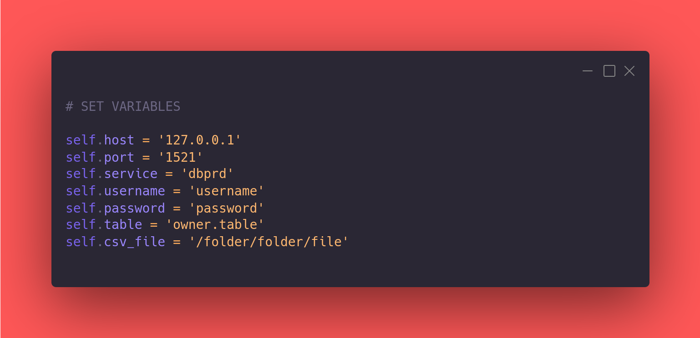
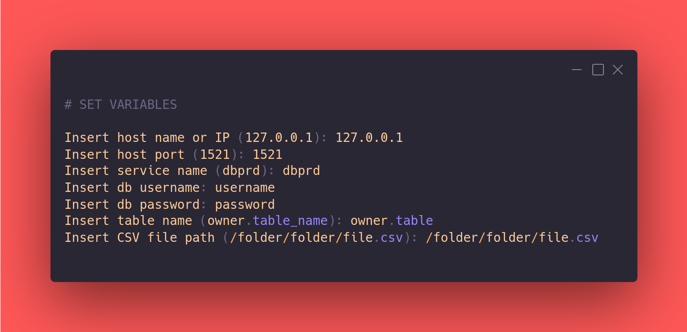
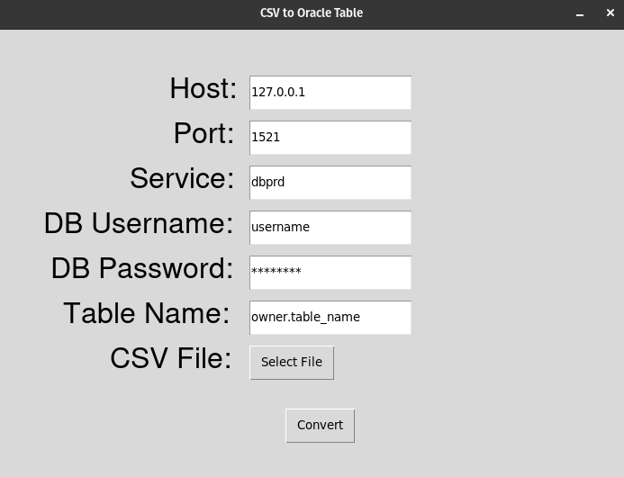

# Fast way to turn a CSV file into a Oracle db table

## 🪢 Prerequisites

### 1. ğŸ Python

### 2. 📦 Python packages:

~~~Bash
$ pip install pandas
$ pip install cx_Oracle
$ pip install unidecode
~~~

## ğŸ› ï¸ ImportCSV editing the Python file

### 1. 📥 Download the ImportCSV.py file.

### 2. 📑 Place it in the same folder that it is the CSV file.

### 3. 📠Configure the variables in ImportCSV.py file.

### 4. âš™ï¸ Run the Python script.

~~~Bash
$ python ImportCSV.py
~~~

### 5. â³ Wait for the script execution to end.

### 🉠Congratulations, your Oracle db table is ready!

## ğŸ› ï¸ ImportCSV with input file

### 1. 📥 Download the ImportCSV_Input.py file.

### 2. 📑 Place it in the same folder that it is the CSV file.

### 3. âš™ï¸ Run the Python script.

~~~Bash
$ python ImportCSV_Input.py
~~~

### 4. 📠Insert the variables in terminal.

### 5. â³ Wait for the script execution to end.

### 🉠Congratulations, your Oracle db table is ready!

## ğŸ› ï¸ ImportCSV with exec file for Windows

### 1. 📥 Download the ImportCSV_GUI.exe file.

### 2. âš™ï¸ Double click on ImportCSV_GUI.exe file.

### 3. 📠Insert the variables in GUI.

### 4. â³ Wait for the script execution to end.

### 🉠Congratulations, your Oracle db table is ready!

## ğŸ› ï¸ ImportCSV with exec file for Linux

### 1. 📥 Download the ImportCSV_GUI file.

### 2. âš™ï¸ Double click on ImportCSV_GUI file.

### 3. 📠Insert the variables in GUI.

### 4. â³ Wait for the script execution to end.

### 🉠Congratulations, your Oracle db table is ready!

  

  